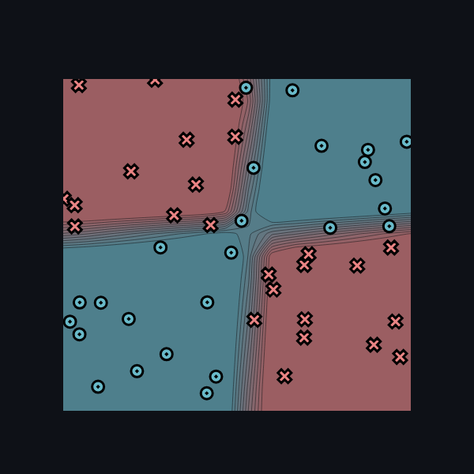

[](https://classroom.github.com/a/YFgwt0yY)
# MiniTorch Module 2


* Docs: https://minitorch.github.io/

* Overview: https://minitorch.github.io/module2/module2/

This assignment requires the following files from the previous assignments. You can get these by running

```bash
python sync_previous_module.py previous-module-dir current-module-dir
```

The files that will be synced are:

        minitorch/operators.py minitorch/module.py minitorch/autodiff.py minitorch/scalar.py minitorch/scalar_functions.py minitorch/module.py project/run_manual.py project/run_scalar.py project/datasets.py

## Dataset 1 (Linear) Results
Number of points: 50
Size of hidden layer: 2
Learning rate: 0.1
Number of epochs: 500

Time per epoch: 0.031s

### Training logs:
Epoch: 0/500, loss: 0, correct: 0
Epoch: 10/500, loss: 34.221584629927825, correct: 33
Epoch: 20/500, loss: 33.516706758323224, correct: 32
Epoch: 30/500, loss: 33.10960056212826, correct: 32
Epoch: 40/500, loss: 32.859795691411456, correct: 32
Epoch: 50/500, loss: 32.69393421529645, correct: 32
Epoch: 60/500, loss: 32.57224216002464, correct: 32
Epoch: 70/500, loss: 32.47229373593878, correct: 32
Epoch: 80/500, loss: 32.380750977723004, correct: 32
Epoch: 90/500, loss: 32.289009717131535, correct: 32
Epoch: 100/500, loss: 32.190821821063714, correct: 32
Epoch: 110/500, loss: 32.080932889380264, correct: 32
Epoch: 120/500, loss: 31.95424102114362, correct: 32
Epoch: 130/500, loss: 31.805214817263927, correct: 32
Epoch: 140/500, loss: 31.627427496782943, correct: 32
Epoch: 150/500, loss: 31.413125512197652, correct: 32
Epoch: 160/500, loss: 31.152781648293622, correct: 32
Epoch: 170/500, loss: 30.83459721816307, correct: 32
Epoch: 180/500, loss: 30.443922299290378, correct: 32
Epoch: 190/500, loss: 29.96256509153825, correct: 32
Epoch: 200/500, loss: 29.367983258729534, correct: 33
Epoch: 210/500, loss: 28.63933381064067, correct: 35
Epoch: 220/500, loss: 27.7687155290238, correct: 39
Epoch: 230/500, loss: 26.73562485826192, correct: 41
Epoch: 240/500, loss: 25.516575580800534, correct: 44
Epoch: 250/500, loss: 24.124645965562472, correct: 46
Epoch: 260/500, loss: 22.59768036908909, correct: 46
Epoch: 270/500, loss: 20.94499668364835, correct: 46
Epoch: 280/500, loss: 19.262661178943933, correct: 48
Epoch: 290/500, loss: 17.588955736005396, correct: 48
Epoch: 300/500, loss: 16.03743315644638, correct: 48
Epoch: 310/500, loss: 14.633863325254806, correct: 49
Epoch: 320/500, loss: 13.413939795334292, correct: 49
Epoch: 330/500, loss: 12.332368756857433, correct: 49
Epoch: 340/500, loss: 11.356059943873769, correct: 49
Epoch: 350/500, loss: 10.50968032347512, correct: 49
Epoch: 360/500, loss: 9.77481111335794, correct: 49
Epoch: 370/500, loss: 9.147630599555503, correct: 49
Epoch: 380/500, loss: 8.587606983806394, correct: 50
Epoch: 390/500, loss: 8.08658445019968, correct: 50
Epoch: 400/500, loss: 7.6373074024553125, correct: 50
Epoch: 410/500, loss: 7.243055026411691, correct: 50
Epoch: 420/500, loss: 6.897704120605102, correct: 50
Epoch: 430/500, loss: 6.584065875582612, correct: 50
Epoch: 440/500, loss: 6.2979171329310395, correct: 50
Epoch: 450/500, loss: 6.03970497658056, correct: 50
Epoch: 460/500, loss: 5.803291826588424, correct: 50
Epoch: 470/500, loss: 5.584757196918464, correct: 50
Epoch: 480/500, loss: 5.380803789302544, correct: 50
Epoch: 490/500, loss: 5.189992168855156, correct: 50
Epoch: 500/500, loss: 5.011093332307256, correct: 50

### Training Visualizations


*Figure 1: Decision boundary for Linear Dataset*


*Figure 2: Loss graph for Linear Dataset*


## Dataset 2 (Diag) Results
Number of points: 50
Size of hidden layer: 2
Learning rate: 0.1
Number of epochs: 500

Time per epoch: 0.031s

### Training logs:
Epoch: 0/1325, loss: 0, correct: 0
Epoch: 0/1325, loss: 0, correct: 0
Epoch: 10/1325, loss: 32.22304309307385, correct: 44
Epoch: 20/1325, loss: 22.11350422790872, correct: 44
Epoch: 30/1325, loss: 19.06914293943849, correct: 44
Epoch: 40/1325, loss: 18.060600136317646, correct: 44
Epoch: 50/1325, loss: 17.625238710631066, correct: 44
Epoch: 60/1325, loss: 17.348209228887907, correct: 44
Epoch: 70/1325, loss: 17.114601056830228, correct: 44
Epoch: 80/1325, loss: 16.888801930445634, correct: 44
Epoch: 90/1325, loss: 16.655455487281227, correct: 44
Epoch: 100/1325, loss: 16.415696653655083, correct: 44
Epoch: 110/1325, loss: 16.171087550315086, correct: 44
Epoch: 120/1325, loss: 15.917038999440328, correct: 44
Epoch: 130/1325, loss: 15.641844296504438, correct: 44
Epoch: 140/1325, loss: 15.34100039913671, correct: 44
Epoch: 150/1325, loss: 15.013894970361486, correct: 44
Epoch: 160/1325, loss: 14.655763867487867, correct: 44
Epoch: 170/1325, loss: 14.265494911752512, correct: 44
Epoch: 180/1325, loss: 13.843947777888527, correct: 44
Epoch: 190/1325, loss: 13.39226103149301, correct: 44
Epoch: 200/1325, loss: 12.911672337271638, correct: 44
Epoch: 210/1325, loss: 12.404801140469507, correct: 44
Epoch: 220/1325, loss: 11.875625394424354, correct: 44
Epoch: 230/1325, loss: 11.329505491290703, correct: 44
Epoch: 240/1325, loss: 10.77305385769627, correct: 44
Epoch: 250/1325, loss: 10.213796591935717, correct: 44
Epoch: 260/1325, loss: 9.664614692494025, correct: 44
Epoch: 270/1325, loss: 9.135806426334925, correct: 44
Epoch: 280/1325, loss: 8.626991881869962, correct: 46
Epoch: 290/1325, loss: 8.152190595253893, correct: 48
Epoch: 300/1325, loss: 7.769628449573896, correct: 48
Epoch: 310/1325, loss: 7.451279981915944, correct: 48
Epoch: 320/1325, loss: 7.174755765320844, correct: 48
Epoch: 330/1325, loss: 6.924094430688517, correct: 48
Epoch: 340/1325, loss: 6.692404722581819, correct: 48
Epoch: 350/1325, loss: 6.473997788208157, correct: 48
Epoch: 360/1325, loss: 6.264893320505585, correct: 48
Epoch: 370/1325, loss: 6.066058720947375, correct: 48
Epoch: 380/1325, loss: 5.873324358498661, correct: 48
Epoch: 390/1325, loss: 5.686845240428085, correct: 48
Epoch: 400/1325, loss: 5.506786262913038, correct: 48
Epoch: 410/1325, loss: 5.335179389916474, correct: 48
Epoch: 420/1325, loss: 5.170071101897593, correct: 48
Epoch: 430/1325, loss: 5.0119441161318905, correct: 48
Epoch: 440/1325, loss: 4.86053832475031, correct: 48
Epoch: 450/1325, loss: 4.713963742402124, correct: 48
Epoch: 460/1325, loss: 4.575915989236951, correct: 48
Epoch: 470/1325, loss: 4.442870143831461, correct: 48
Epoch: 480/1325, loss: 4.31654863669544, correct: 48
Epoch: 490/1325, loss: 4.195379026008818, correct: 48
Epoch: 500/1325, loss: 4.079573247070573, correct: 49
Epoch: 510/1325, loss: 3.9695094380226537, correct: 49
Epoch: 520/1325, loss: 3.8653271671589517, correct: 49
Epoch: 530/1325, loss: 3.766250420264789, correct: 49
Epoch: 540/1325, loss: 3.6718827445702167, correct: 49
Epoch: 550/1325, loss: 3.5819902185763977, correct: 49
Epoch: 560/1325, loss: 3.4963461897975967, correct: 49
Epoch: 570/1325, loss: 3.414727685557005, correct: 49
Epoch: 580/1325, loss: 3.336240285764427, correct: 49
Epoch: 590/1325, loss: 3.2621363416874103, correct: 49
Epoch: 600/1325, loss: 3.1912155388529464, correct: 49
Epoch: 610/1325, loss: 3.1234021291096172, correct: 49
Epoch: 620/1325, loss: 3.0594626433109404, correct: 49
Epoch: 630/1325, loss: 2.9978392823343722, correct: 49
Epoch: 640/1325, loss: 2.939411896503024, correct: 49
Epoch: 650/1325, loss: 2.883187138198094, correct: 49
Epoch: 660/1325, loss: 2.8297854183238584, correct: 49
Epoch: 670/1325, loss: 2.7789513375966113, correct: 49
Epoch: 680/1325, loss: 2.7302113918158137, correct: 49
Epoch: 690/1325, loss: 2.683431839150639, correct: 49
Epoch: 700/1325, loss: 2.638489093224065, correct: 49
Epoch: 710/1325, loss: 2.5952688668441692, correct: 49
Epoch: 720/1325, loss: 2.553665491675438, correct: 49
Epoch: 730/1325, loss: 2.5135812692202926, correct: 49
Epoch: 740/1325, loss: 2.4749258566953896, correct: 49
Epoch: 750/1325, loss: 2.4376156899451122, correct: 49
Epoch: 760/1325, loss: 2.401573444187961, correct: 50
Epoch: 770/1325, loss: 2.3667275324027512, correct: 50
Epoch: 780/1325, loss: 2.3330116404566814, correct: 50
Epoch: 790/1325, loss: 2.300364297591373, correct: 50
Epoch: 800/1325, loss: 2.268728480564658, correct: 50
Epoch: 810/1325, loss: 2.2380512495541667, correct: 50
Epoch: 820/1325, loss: 2.2082834138311753, correct: 50
Epoch: 830/1325, loss: 2.179379225185115, correct: 50
Epoch: 840/1325, loss: 2.151296097100583, correct: 50
Epoch: 850/1325, loss: 2.1239943477454304, correct: 50
Epoch: 860/1325, loss: 2.0974369649084985, correct: 50
Epoch: 870/1325, loss: 2.0715893911208894, correct: 50
Epoch: 880/1325, loss: 2.04641932729842, correct: 50
Epoch: 890/1325, loss: 2.0218965533508197, correct: 50
Epoch: 900/1325, loss: 1.9979927643115112, correct: 50
Epoch: 910/1325, loss: 1.9746814206484489, correct: 50
Epoch: 920/1325, loss: 1.9519376115193563, correct: 50
Epoch: 930/1325, loss: 1.9297379298332247, correct: 50
Epoch: 940/1325, loss: 1.9080603580727538, correct: 50
Epoch: 950/1325, loss: 1.886884163920144, correct: 50
Epoch: 960/1325, loss: 1.8661898048098013, correct: 50
Epoch: 970/1325, loss: 1.8459588406076224, correct: 50
Epoch: 980/1325, loss: 1.8261738536864704, correct: 50
Epoch: 990/1325, loss: 1.8068183757321437, correct: 50
Epoch: 1000/1325, loss: 1.7878768206736189, correct: 50
Epoch: 1010/1325, loss: 1.7693344231859705, correct: 50
Epoch: 1020/1325, loss: 1.7511771822643667, correct: 50
Epoch: 1030/1325, loss: 1.733391809413169, correct: 50
Epoch: 1040/1325, loss: 1.7159656810361508, correct: 50
Epoch: 1050/1325, loss: 1.6988867946516846, correct: 50
Epoch: 1060/1325, loss: 1.6821437285916183, correct: 50
Epoch: 1070/1325, loss: 1.6657256048741245, correct: 50
Epoch: 1080/1325, loss: 1.6496220549694798, correct: 50
Epoch: 1090/1325, loss: 1.6338231882038685, correct: 50
Epoch: 1100/1325, loss: 1.6183195625700886, correct: 50
Epoch: 1110/1325, loss: 1.603102157735329, correct: 50
Epoch: 1120/1325, loss: 1.5881623500560595, correct: 50
Epoch: 1130/1325, loss: 1.5734918894273315, correct: 50
Epoch: 1140/1325, loss: 1.559082877810199, correct: 50
Epoch: 1150/1325, loss: 1.544941148980914, correct: 50
Epoch: 1160/1325, loss: 1.5310631733365974, correct: 50
Epoch: 1170/1325, loss: 1.5174232211965728, correct: 50
Epoch: 1180/1325, loss: 1.5040146913276347, correct: 50
Epoch: 1190/1325, loss: 1.4908312471461838, correct: 50
Epoch: 1200/1325, loss: 1.477866798967706, correct: 50
Epoch: 1210/1325, loss: 1.4651154914426965, correct: 50
Epoch: 1220/1325, loss: 1.4525716917694032, correct: 50
Epoch: 1230/1325, loss: 1.440229978628898, correct: 50
Epoch: 1240/1325, loss: 1.4280851317910777, correct: 50
Epoch: 1250/1325, loss: 1.4161321223443664, correct: 50
Epoch: 1260/1325, loss: 1.404366103505487, correct: 50
Epoch: 1270/1325, loss: 1.3927824019693298, correct: 50
Epoch: 1280/1325, loss: 1.381376509761936, correct: 50
Epoch: 1290/1325, loss: 1.3701440765624824, correct: 50
Epoch: 1300/1325, loss: 1.3590809024629127, correct: 50
Epoch: 1310/1325, loss: 1.3481829311360196, correct: 50
Epoch: 1320/1325, loss: 1.3374462433852137, correct: 50
Epoch: 1325/1325, loss: 1.332137192092052, correct: 50

### Training Visualizations


*Figure 3: Decision boundary for Diag Dataset*


*Figure 4: Loss graph for Diag Dataset*


## Dataset 3 (Split) Results
Number of points: 50
Size of hidden layer: 3
Learning rate: 0.5
Number of epochs: 1325

Time per epoch: 0.046s

### Training logs:
Epoch: 0/1325, loss: 0, correct: 0
Epoch: 0/1325, loss: 0, correct: 0
Epoch: 10/1325, loss: 34.44234184587127, correct: 28
Epoch: 20/1325, loss: 34.34579838727314, correct: 28
Epoch: 30/1325, loss: 34.311246092948714, correct: 28
Epoch: 40/1325, loss: 34.28283026290404, correct: 28
Epoch: 50/1325, loss: 34.24328207938845, correct: 28
Epoch: 60/1325, loss: 34.21280986657266, correct: 28
Epoch: 70/1325, loss: 34.17491909496652, correct: 28
Epoch: 80/1325, loss: 34.13410145983466, correct: 28
Epoch: 90/1325, loss: 34.08172162840248, correct: 28
Epoch: 100/1325, loss: 34.00669975858772, correct: 28
Epoch: 110/1325, loss: 33.916658669592046, correct: 28
Epoch: 120/1325, loss: 33.79693486198778, correct: 28
Epoch: 130/1325, loss: 33.63103693178534, correct: 28
Epoch: 140/1325, loss: 33.394397189025355, correct: 28
Epoch: 150/1325, loss: 33.04722335898342, correct: 29
Epoch: 160/1325, loss: 32.534159147732076, correct: 32
Epoch: 170/1325, loss: 31.771754715697135, correct: 35
Epoch: 180/1325, loss: 30.65829160568258, correct: 34
Epoch: 190/1325, loss: 29.067431455364165, correct: 37
Epoch: 200/1325, loss: 31.005413327112173, correct: 28
Epoch: 210/1325, loss: 29.223634937846864, correct: 30
Epoch: 220/1325, loss: 28.209807430745354, correct: 31
Epoch: 230/1325, loss: 29.695876483602692, correct: 30
Epoch: 240/1325, loss: 28.76035478142832, correct: 31
Epoch: 250/1325, loss: 25.891360147811405, correct: 34
Epoch: 260/1325, loss: 27.019320358049452, correct: 33
Epoch: 270/1325, loss: 32.07609611772739, correct: 31
Epoch: 280/1325, loss: 24.53592048364221, correct: 36
Epoch: 290/1325, loss: 25.003652595005942, correct: 36
Epoch: 300/1325, loss: 24.262358437872475, correct: 38
Epoch: 310/1325, loss: 19.53865595623744, correct: 44
Epoch: 320/1325, loss: 23.451893996448867, correct: 40
Epoch: 330/1325, loss: 17.917779219519957, correct: 44
Epoch: 340/1325, loss: 22.844367412505118, correct: 40
Epoch: 350/1325, loss: 16.094035734852977, correct: 44
Epoch: 360/1325, loss: 18.045398982587216, correct: 44
Epoch: 370/1325, loss: 17.061804531908717, correct: 44
Epoch: 380/1325, loss: 23.25386214818934, correct: 40
Epoch: 390/1325, loss: 10.776702557014714, correct: 47
Epoch: 400/1325, loss: 19.619261791537863, correct: 41
Epoch: 410/1325, loss: 8.205424069526641, correct: 48
Epoch: 420/1325, loss: 10.103364642835965, correct: 48
Epoch: 430/1325, loss: 7.700280764730377, correct: 47
Epoch: 440/1325, loss: 9.273327078862982, correct: 46
Epoch: 450/1325, loss: 7.157279926433809, correct: 48
Epoch: 460/1325, loss: 24.47474001324634, correct: 39
Epoch: 470/1325, loss: 5.12467450423501, correct: 49
Epoch: 480/1325, loss: 8.353467808437458, correct: 47
Epoch: 490/1325, loss: 10.127851364775765, correct: 44
Epoch: 500/1325, loss: 4.887448858628611, correct: 49
Epoch: 510/1325, loss: 8.261309994788505, correct: 48
Epoch: 520/1325, loss: 8.28928471622818, correct: 48
Epoch: 530/1325, loss: 8.325167737536074, correct: 44
Epoch: 540/1325, loss: 29.851385461981348, correct: 41
Epoch: 550/1325, loss: 4.038264520186492, correct: 49
Epoch: 560/1325, loss: 3.9959219344488415, correct: 49
Epoch: 570/1325, loss: 8.785403607486952, correct: 45
Epoch: 580/1325, loss: 6.483388818392635, correct: 48
Epoch: 590/1325, loss: 5.2822244381136905, correct: 48
Epoch: 600/1325, loss: 3.545477791064397, correct: 49
Epoch: 610/1325, loss: 5.882514294544366, correct: 49
Epoch: 620/1325, loss: 3.5963055679288116, correct: 49
Epoch: 630/1325, loss: 3.239005652640607, correct: 50
Epoch: 640/1325, loss: 3.3374566769633733, correct: 50
Epoch: 650/1325, loss: 2.638111402745402, correct: 50
Epoch: 660/1325, loss: 5.238037506388571, correct: 49
Epoch: 670/1325, loss: 3.3814414482376636, correct: 49
Epoch: 680/1325, loss: 8.748130779938629, correct: 46
Epoch: 690/1325, loss: 1.855731453019002, correct: 50
Epoch: 700/1325, loss: 3.0916304342480165, correct: 49
Epoch: 710/1325, loss: 1.5192484150567476, correct: 50
Epoch: 720/1325, loss: 6.2626710626968345, correct: 47
Epoch: 730/1325, loss: 4.823874669598932, correct: 47
Epoch: 740/1325, loss: 2.7508125830336283, correct: 49
Epoch: 750/1325, loss: 1.289171065470027, correct: 50
Epoch: 760/1325, loss: 1.5162816932685608, correct: 50
Epoch: 770/1325, loss: 75.35896089013387, correct: 34
Epoch: 780/1325, loss: 3.0103857517188763, correct: 49
Epoch: 790/1325, loss: 5.009457573807063, correct: 48
Epoch: 800/1325, loss: 2.3471858850570757, correct: 49
Epoch: 810/1325, loss: 84.57033084818711, correct: 28
Epoch: 820/1325, loss: 3.6455423827733817, correct: 49
Epoch: 830/1325, loss: 2.904396115490061, correct: 49
Epoch: 840/1325, loss: 3.79215301899335, correct: 49
Epoch: 850/1325, loss: 1.1197445944157107, correct: 50
Epoch: 860/1325, loss: 1.0446906802013423, correct: 50
Epoch: 870/1325, loss: 6.0515943894465725, correct: 48
Epoch: 880/1325, loss: 2.357478582489087, correct: 49
Epoch: 890/1325, loss: 0.9902071033712303, correct: 50
Epoch: 900/1325, loss: 0.9918218245809329, correct: 50
Epoch: 910/1325, loss: 6.931036254373077, correct: 47
Epoch: 920/1325, loss: 4.866714725313176, correct: 47
Epoch: 930/1325, loss: 4.175590182484522, correct: 48
Epoch: 940/1325, loss: 3.0665820638406833, correct: 49
Epoch: 950/1325, loss: 2.093405394596845, correct: 49
Epoch: 960/1325, loss: 0.9369124404346558, correct: 50
Epoch: 970/1325, loss: 0.6816274404297956, correct: 50
Epoch: 980/1325, loss: 0.5858889764917756, correct: 50
Epoch: 990/1325, loss: 0.5286826567898242, correct: 50
Epoch: 1000/1325, loss: 0.5052524058034561, correct: 50
Epoch: 1010/1325, loss: 0.5025254842492306, correct: 50
Epoch: 1020/1325, loss: 10.660746959867812, correct: 46
Epoch: 1030/1325, loss: 4.774250482362347, correct: 49
Epoch: 1040/1325, loss: 3.0999581058276813, correct: 49
Epoch: 1050/1325, loss: 2.4347257367359165, correct: 49
Epoch: 1060/1325, loss: 2.060367780621897, correct: 49
Epoch: 1070/1325, loss: 1.676820985770456, correct: 49
Epoch: 1080/1325, loss: 3.9265346558713397, correct: 48
Epoch: 1090/1325, loss: 0.7360587326367434, correct: 50
Epoch: 1100/1325, loss: 0.5627701845355397, correct: 50
Epoch: 1110/1325, loss: 0.4939556100088521, correct: 50
Epoch: 1120/1325, loss: 0.4504701031709112, correct: 50
Epoch: 1130/1325, loss: 0.4157388822244322, correct: 50
Epoch: 1140/1325, loss: 0.38836196580290244, correct: 50
Epoch: 1150/1325, loss: 0.3650506262949988, correct: 50
Epoch: 1160/1325, loss: 0.3455846648542117, correct: 50
Epoch: 1170/1325, loss: 0.3281570914129353, correct: 50
Epoch: 1180/1325, loss: 0.3128928012687672, correct: 50
Epoch: 1190/1325, loss: 0.29910752863819506, correct: 50
Epoch: 1200/1325, loss: 0.28658763964127393, correct: 50
Epoch: 1210/1325, loss: 0.2751894254867031, correct: 50
Epoch: 1220/1325, loss: 0.2647096602667731, correct: 50
Epoch: 1230/1325, loss: 0.2550677098490352, correct: 50
Epoch: 1240/1325, loss: 0.2461640299277126, correct: 50
Epoch: 1250/1325, loss: 0.23791455953201274, correct: 50
Epoch: 1260/1325, loss: 0.23024825569982418, correct: 50
Epoch: 1270/1325, loss: 0.2231188149613314, correct: 50
Epoch: 1280/1325, loss: 0.21644414301019493, correct: 50
Epoch: 1290/1325, loss: 0.2101959889817249, correct: 50
Epoch: 1300/1325, loss: 0.20433413794253005, correct: 50
Epoch: 1310/1325, loss: 0.19884254675051086, correct: 50
Epoch: 1320/1325, loss: 0.19364264386943758, correct: 50
Epoch: 1325/1325, loss: 0.191154813107099, correct: 50

### Training Visualizations


*Figure 5: Decision boundary for Split Dataset*


*Figure 6: Loss graph for Split Dataset*


## Dataset 4 (XOR) Results
Number of points: 50
Size of hidden layer: 8
Learning rate: 0.1
Number of epochs: 1100

Time per epoch: 0.156s

### Training logs:
Epoch: 0/975, loss: 0, correct: 0
Epoch: 0/1050, loss: 0, correct: 0
Epoch: 10/1050, loss: 51.05178085154091, correct: 25
Epoch: 20/1050, loss: 42.51689412887024, correct: 25
Epoch: 30/1050, loss: 38.972328127841905, correct: 25
Epoch: 40/1050, loss: 37.14527264781833, correct: 25
Epoch: 50/1050, loss: 36.11500444659494, correct: 25
Epoch: 60/1050, loss: 35.51585307892398, correct: 25
Epoch: 70/1050, loss: 35.15872446991342, correct: 25
Epoch: 80/1050, loss: 34.94757315256189, correct: 25
Epoch: 90/1050, loss: 34.82823965548285, correct: 29
Epoch: 100/1050, loss: 34.75527912038551, correct: 32
Epoch: 110/1050, loss: 34.70352715326273, correct: 33
Epoch: 120/1050, loss: 34.669412519715046, correct: 29
Epoch: 130/1050, loss: 34.64583015666602, correct: 28
Epoch: 140/1050, loss: 34.627855756669184, correct: 26
Epoch: 150/1050, loss: 34.61253579801602, correct: 26
Epoch: 160/1050, loss: 34.600351864707264, correct: 26
Epoch: 170/1050, loss: 34.588425707416434, correct: 26
Epoch: 180/1050, loss: 34.57898374669223, correct: 25
Epoch: 190/1050, loss: 34.569508943139496, correct: 25
Epoch: 200/1050, loss: 34.55698447820635, correct: 25
Epoch: 210/1050, loss: 34.537547808812974, correct: 25
Epoch: 220/1050, loss: 34.522392691981054, correct: 25
Epoch: 230/1050, loss: 34.50681616699292, correct: 25
Epoch: 240/1050, loss: 34.49347397823365, correct: 25
Epoch: 250/1050, loss: 34.47919853024837, correct: 25
Epoch: 260/1050, loss: 34.46367885647396, correct: 25
Epoch: 270/1050, loss: 34.44856056481532, correct: 25
Epoch: 280/1050, loss: 34.43255086159597, correct: 25
Epoch: 290/1050, loss: 34.41598716954683, correct: 25
Epoch: 300/1050, loss: 34.39938703960985, correct: 25
Epoch: 310/1050, loss: 34.38732391393198, correct: 25
Epoch: 320/1050, loss: 34.374832871745284, correct: 25
Epoch: 330/1050, loss: 34.360379057845215, correct: 25
Epoch: 340/1050, loss: 34.347631412955145, correct: 25
Epoch: 350/1050, loss: 34.33516685375669, correct: 25
Epoch: 360/1050, loss: 34.32289871094647, correct: 25
Epoch: 370/1050, loss: 34.312279359340515, correct: 25
Epoch: 380/1050, loss: 34.29840081410521, correct: 26
Epoch: 390/1050, loss: 34.283731900030354, correct: 26
Epoch: 400/1050, loss: 34.26886917929814, correct: 26
Epoch: 410/1050, loss: 34.25336388992932, correct: 26
Epoch: 420/1050, loss: 34.238213812565384, correct: 26
Epoch: 430/1050, loss: 34.223021954397616, correct: 26
Epoch: 440/1050, loss: 34.21131471673118, correct: 26
Epoch: 450/1050, loss: 34.20093948381615, correct: 26
Epoch: 0/1050, loss: 0, correct: 0
Epoch: 0/1050, loss: 0, correct: 0
Epoch: 0/1100, loss: 0, correct: 0
Epoch: 10/1100, loss: 33.67356657409145, correct: 33
Epoch: 20/1100, loss: 32.90830890171446, correct: 41
Epoch: 30/1100, loss: 32.47999847556447, correct: 43
Epoch: 40/1100, loss: 32.15153234112855, correct: 45
Epoch: 50/1100, loss: 31.839127139287235, correct: 44
Epoch: 60/1100, loss: 31.519735492984957, correct: 43
Epoch: 70/1100, loss: 31.19146356673883, correct: 42
Epoch: 80/1100, loss: 30.856082552780855, correct: 43
Epoch: 90/1100, loss: 30.508096287872117, correct: 43
Epoch: 100/1100, loss: 30.14023234135131, correct: 43
Epoch: 110/1100, loss: 29.747753013038576, correct: 43
Epoch: 120/1100, loss: 29.330286480698163, correct: 41
Epoch: 130/1100, loss: 28.895801367499274, correct: 41
Epoch: 140/1100, loss: 28.448318600581906, correct: 42
Epoch: 150/1100, loss: 27.982140815276278, correct: 42
Epoch: 160/1100, loss: 27.498097374625466, correct: 42
Epoch: 170/1100, loss: 26.99972283759524, correct: 42
Epoch: 180/1100, loss: 26.48183957634508, correct: 42
Epoch: 190/1100, loss: 25.944534938258137, correct: 42
Epoch: 200/1100, loss: 25.396869284043117, correct: 43
Epoch: 210/1100, loss: 24.834442314444527, correct: 43
Epoch: 220/1100, loss: 24.25801516941358, correct: 44
Epoch: 230/1100, loss: 23.67993781962576, correct: 44
Epoch: 240/1100, loss: 23.0931194188686, correct: 44
Epoch: 250/1100, loss: 22.504764508723824, correct: 44
Epoch: 260/1100, loss: 21.92137483565994, correct: 44
Epoch: 270/1100, loss: 21.339667738467657, correct: 46
Epoch: 280/1100, loss: 20.76528019177336, correct: 46
Epoch: 290/1100, loss: 20.2019549244951, correct: 46
Epoch: 300/1100, loss: 19.644560091131225, correct: 45
Epoch: 310/1100, loss: 19.10616336357821, correct: 45
Epoch: 320/1100, loss: 18.571497841297916, correct: 45
Epoch: 330/1100, loss: 18.02955320616748, correct: 45
Epoch: 340/1100, loss: 17.533338890549633, correct: 45
Epoch: 350/1100, loss: 17.064063569931417, correct: 46
Epoch: 360/1100, loss: 16.60409043929816, correct: 46
Epoch: 370/1100, loss: 16.162460002312482, correct: 46
Epoch: 380/1100, loss: 15.701751951680384, correct: 46
Epoch: 390/1100, loss: 15.275383312337983, correct: 46
Epoch: 400/1100, loss: 14.852292629862239, correct: 46
Epoch: 410/1100, loss: 14.44124169129718, correct: 46
Epoch: 420/1100, loss: 14.052013711168819, correct: 46
Epoch: 430/1100, loss: 13.68253568603813, correct: 46
Epoch: 440/1100, loss: 13.33342281681359, correct: 46
Epoch: 450/1100, loss: 12.997040461969956, correct: 46
Epoch: 460/1100, loss: 12.667511142884681, correct: 46
Epoch: 470/1100, loss: 12.352187847183538, correct: 46
Epoch: 480/1100, loss: 12.050605166074808, correct: 47
Epoch: 490/1100, loss: 11.772469045262932, correct: 47
Epoch: 500/1100, loss: 11.490362241514443, correct: 47
Epoch: 510/1100, loss: 11.225632834828845, correct: 47
Epoch: 520/1100, loss: 10.97306947712554, correct: 48
Epoch: 530/1100, loss: 10.733512772645751, correct: 48
Epoch: 540/1100, loss: 10.496511678520292, correct: 49
Epoch: 550/1100, loss: 10.272132817687528, correct: 49
Epoch: 560/1100, loss: 10.05625524056986, correct: 49
Epoch: 570/1100, loss: 9.848476463962804, correct: 49
Epoch: 580/1100, loss: 9.651229047542278, correct: 49
Epoch: 590/1100, loss: 9.457012886727982, correct: 50
Epoch: 600/1100, loss: 9.276044410261036, correct: 50
Epoch: 610/1100, loss: 9.096906273677195, correct: 50
Epoch: 620/1100, loss: 8.924453018636092, correct: 50
Epoch: 630/1100, loss: 8.756179990453633, correct: 50
Epoch: 640/1100, loss: 8.595385874549827, correct: 50
Epoch: 650/1100, loss: 8.441016175782506, correct: 50
Epoch: 660/1100, loss: 8.295116759923395, correct: 50
Epoch: 670/1100, loss: 8.14967959344639, correct: 50
Epoch: 680/1100, loss: 8.006064436267058, correct: 50
Epoch: 690/1100, loss: 7.869438090823497, correct: 50
Epoch: 700/1100, loss: 7.7379455461354, correct: 50
Epoch: 710/1100, loss: 7.6103091317907605, correct: 50
Epoch: 720/1100, loss: 7.4847754831026805, correct: 50
Epoch: 730/1100, loss: 7.3645763361907814, correct: 50
Epoch: 740/1100, loss: 7.251183496723578, correct: 50
Epoch: 750/1100, loss: 7.13792949390488, correct: 50
Epoch: 760/1100, loss: 7.022151866633972, correct: 50
Epoch: 770/1100, loss: 6.915813063988364, correct: 50
Epoch: 780/1100, loss: 6.813239713133932, correct: 50
Epoch: 790/1100, loss: 6.707645148880317, correct: 50
Epoch: 800/1100, loss: 6.61051230677013, correct: 50
Epoch: 810/1100, loss: 6.5102907816732625, correct: 50
Epoch: 820/1100, loss: 6.41689610381647, correct: 50
Epoch: 830/1100, loss: 6.321126423652195, correct: 50
Epoch: 840/1100, loss: 6.232136578908295, correct: 50
Epoch: 850/1100, loss: 6.144414018581485, correct: 50
Epoch: 860/1100, loss: 6.056228161054338, correct: 50
Epoch: 870/1100, loss: 5.972128297654506, correct: 50
Epoch: 880/1100, loss: 5.887414662200431, correct: 50
Epoch: 890/1100, loss: 5.805235472858169, correct: 50
Epoch: 900/1100, loss: 5.724918609782226, correct: 50
Epoch: 910/1100, loss: 5.646999964151233, correct: 50
Epoch: 920/1100, loss: 5.568306800537564, correct: 50
Epoch: 930/1100, loss: 5.493325572567374, correct: 50
Epoch: 940/1100, loss: 5.417940076852992, correct: 50
Epoch: 950/1100, loss: 5.345240976245478, correct: 50
Epoch: 960/1100, loss: 5.2746008869867085, correct: 50
Epoch: 970/1100, loss: 5.203210409734058, correct: 50
Epoch: 980/1100, loss: 5.140427623886673, correct: 50
Epoch: 990/1100, loss: 5.069058267114329, correct: 50
Epoch: 1000/1100, loss: 5.011729581737261, correct: 50
Epoch: 1010/1100, loss: 4.944654125258695, correct: 50
Epoch: 1020/1100, loss: 4.875738364878105, correct: 50
Epoch: 1030/1100, loss: 4.815288762826693, correct: 50
Epoch: 1040/1100, loss: 4.7618010148775785, correct: 50
Epoch: 1050/1100, loss: 4.698564083540865, correct: 50
Epoch: 1060/1100, loss: 4.634654180745851, correct: 50
Epoch: 1070/1100, loss: 4.5770277121752985, correct: 50
Epoch: 1080/1100, loss: 4.520340972282602, correct: 50
Epoch: 1090/1100, loss: 4.464530581350331, correct: 50
Epoch: 1100/1100, loss: 4.412329299296545, correct: 50

### Training Visualizations


*Figure 7: Decision boundary for XOR Dataset*


*Figure 8: Loss graph for XOR Dataset*
